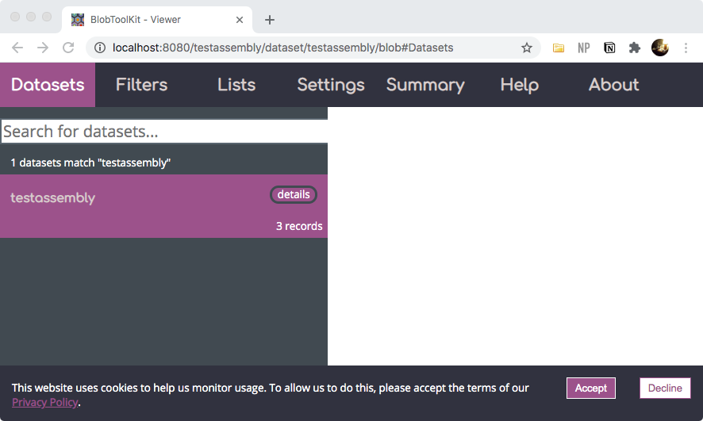

# attempt_blobtoolkit

Attempt to run blobtoolkit on a small public dataset, on MacOS v10.13.6. This pipeline kinda reminds me of nextstrain...altho for different purposes.

## Citations

* Challis, R., Richards, E., Rajan, J., Cochrane, G. and Blaxter, M., 2020. [BlobToolKit–Interactive quality assessment of genome assemblies](https://pubmed.ncbi.nlm.nih.gov/32071071/). G3: Genes, Genomes, Genetics, 10(4), pp.1361-1374.
* Laetsch, D.R. and Blaxter, M.L., 2017. [BlobTools: Interrogation of genome assemblies](https://f1000research.com/articles/6-1287). F1000Research, 6(1287), p.1287.
* [Main Blobtoolkit Genomie Hubs Website](https://blobtoolkit.genomehubs.org/)

## Dependendencies

According to [BlobToolKit documentation](https://blobtoolkit.genomehubs.org/install/), seems to require:

* [Install Conda](https://docs.conda.io/projects/conda/en/latest/user-guide/install/)
* [Install Firefox](https://www.mozilla.org/en-US/firefox/new/)
* [Install X11](https://kb.thayer.dartmouth.edu/article/336-x11-for-windows-and-mac)

<details><summary>Install blobtools on MacOS - seems to be working</summary>

```
git clone https://github.com/blobtoolkit/blobtools2.git
```

When in python, use `venv` or `conda`. I'm on MacOS v10.13.6 with brew-installed venv

```
python3 -m venv blobworld
# conda create -n btk_env

source blobworld/bin/activate
pip install -r blobtoolkit/requirements.txt
```

Actually this seems to require multiple git repos... 

<details><summary>Expand to see the 4 repos</summary>

```
git clone https://github.com/blobtoolkit/blobtools2;
git clone https://github.com/blobtoolkit/viewer;
git clone https://github.com/blobtoolkit/specification;
git clone https://github.com/blobtoolkit/insdc-pipeline;
```

</details>

is there a reason why they're not using [git submodules](https://www.vogella.com/tutorials/GitSubmodules/article.html)?

```
git clone --recursive main_git_repo_that_points_to_several_others.git 
```

Fetching other repos went fine, but then fetching NCBI `nt` was too large, my laptop ran out of space...it needs the entire `nt`? Why not focus on a particular species or do remote blast?

Okay - so turns out pulling all of NCBI nt is not necessary. Continuing with rediculously minimal example

</details>

<details><summary>Minimal Example - in progress</summary>

Created a really small assembly file.

**assembly.fasta**

```
>One
AAAAAAAAAAAAAAAAAAAAAAAAAAAAAAAAA
>Two
AAAAAAAAAAAAAAACCCCCCCCCCCCCCCCCC
>Three
AAAAAAAACCCCCCCCCCCCCCCCCCGGGGGGG
```

Based on [this documentation](https://blobtoolkit.genomehubs.org/blobtools2/blobtools2-tutorials/getting-started-with-blobtools2/#create_blobdir), in bash we can create a folder

```
./blobtools2/blobtools create --fasta assembly.fasta testassembly
#> Loading sequences from assembly.fasta
#> - processing Three: : 3it [00:00, 532.00it/s]

ls -ltr testassembly/
#> total 40
#> -rw-r--r--  1 jenchang  staff    63B Jul 20 11:01 identifiers.json
#> -rw-r--r--  1 jenchang  staff    61B Jul 20 11:01 gc.json
#> -rw-r--r--  1 jenchang  staff    52B Jul 20 11:01 length.json
#> -rw-r--r--  1 jenchang  staff    49B Jul 20 11:01 ncount.json
#> -rw-r--r--  1 jenchang  staff   883B Jul 20 11:01 meta.json
```

You may need to link some metadata... including mapping to an assembly...need a different minimal example.

```
./blobtools2/blobtools host `pwd`
#> Starting BlobToolKit API on port 8000 (pid: 85432)
#> Starting BlobToolKit viewer on port 8080 (pid: 85434)
#> Visit http://localhost:8080 to use the interactive BlobToolKit Viewer.
```

Then open `http://localhost:8080` in browser.

</details>

What it looks like currently -- need to add blast/more metadata



